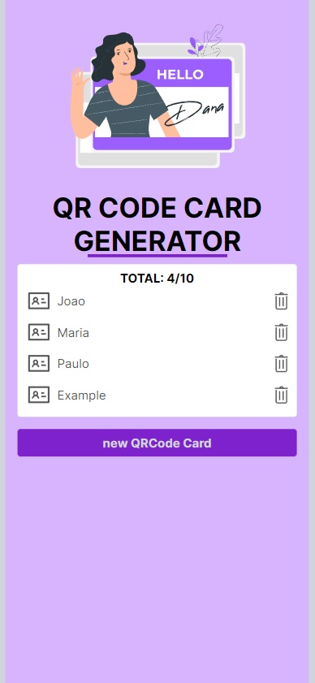
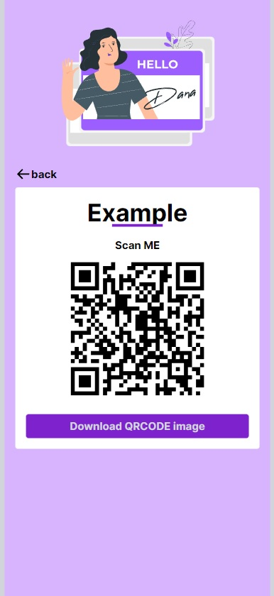

# QR Code Card Generator

## Description

QR Code Card Generator is a web application to manage and to generate business cards with QRCode. With qrcode image, people can scan it and see all information on a new page.

image: [Storyset](https://storyset.com/illustration/hello/pana)

## Technologies used

- next
- react
- react-icons
- qrcode
- react-qr-code
- jest
- react-testing-library
- styled-components

## Getting started

#### QR Code card api

First is necessary to clone and start the [qr-code-card-api](https://github.com/gustavool/qr-code-card-api) below:
`git clone https://github.com/gustavool/qr-code-card-api.git`

#### Clone this repository

`git clone https://github.com/gustavool/qr-code-card-client.git`

#### Install dependencies

inside the main folder execute: `npm install`

#### Run project

rename `.env.example` to `.env` and run `npm run dev`

## Images

